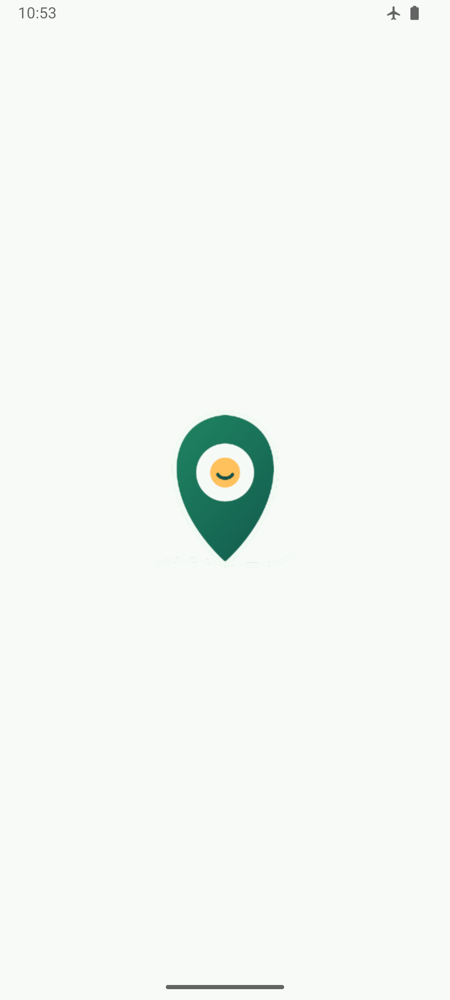
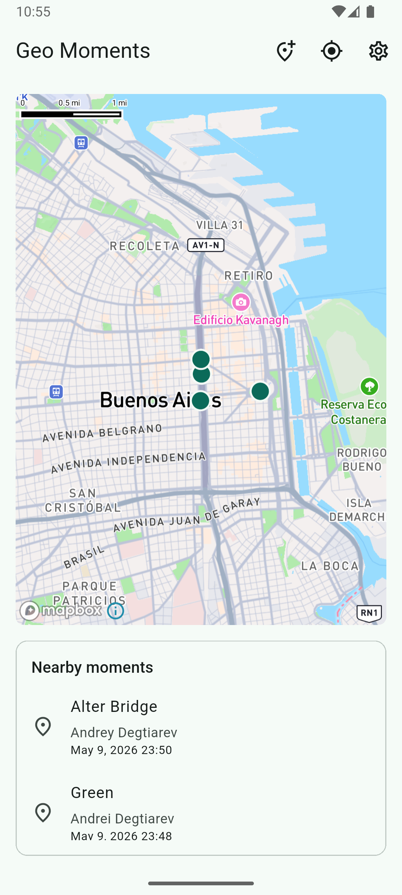
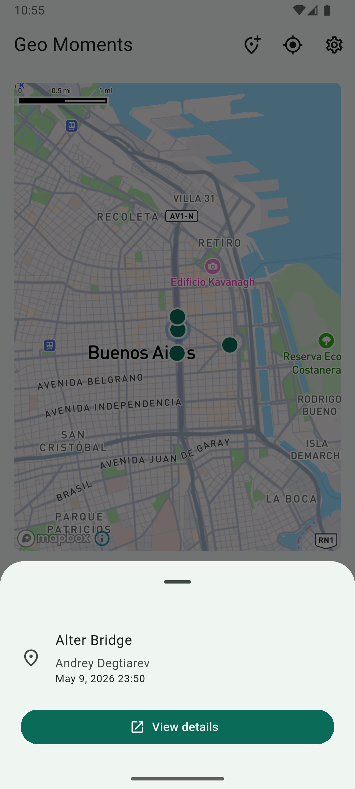
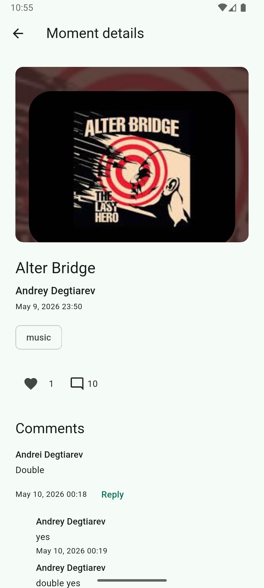
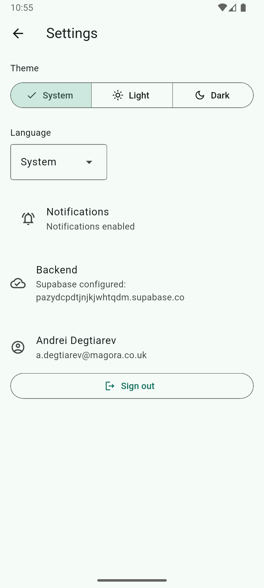

# Geo Moments

Geo Moments is a cross-platform Flutter app for saving and discovering media moments on a map. A user can attach a photo or video to a real-world location, describe the emotion or context of that place, and continue the conversation through likes, comments, replies, and push notifications.

The project is built as a portfolio-grade mobile app: it includes production-style architecture, Supabase backend integration, Mapbox maps, Firebase Cloud Messaging, local offline cache, localization, adaptive layouts, tests, and release preparation for Android/iOS.

## Screenshots

<p>
  
  
  
  
  
</p>

## Product Idea

Most social apps are feed-first: the content is detached from the physical place where it happened. Geo Moments flips that model. The map is the primary interface, and each point represents a short media-backed memory tied to a location.

The app solves these user-facing problems:

- Discover nearby moments visually instead of scrolling a generic feed.
- Save a place with photo/video context and a short emotional note.
- Open details for a moment, like it, comment on it, and reply to comments.
- Receive push notifications when someone responds.
- Keep the app useful during weak connectivity with cached nearby moments and cached details.

## Features

- Map-first discovery with Mapbox markers and camera-aware nearby loading.
- Photo/video moment creation using the device camera or media picker.
- Supabase Storage upload with rollback if the database insert fails.
- Moment details with media, author display name, emotion tag, like count, and comment count.
- Likes with optimistic UI, idempotent backend commands, and rollback on failure.
- Comments and one-level replies with Supabase Realtime refresh.
- Firebase push notifications for comments and replies.
- Notification tap routing into the correct moment details screen.
- Local Drift/SQLite read-side cache for nearby moments and details.
- Offline-tolerant startup that does not block on auth/profile sync.
- Responsive layouts: compact phone bottom sheet preview and tablet/wide side panel.
- English, Russian, and Spanish localization.
- Light/dark/system theme support.
- Android launcher icon, splash screen, release signing template, and release checklists.

## Architecture

The app uses a feature-first Flutter structure with explicit boundaries between UI, state, domain models, data repositories, and platform services.

```text
lib/
  main.dart
  src/
    app/                 app shell, bootstrap, router, theme, localization
    core/                database, lifecycle, logging, retry/failure handling, UI tokens
    features/
      auth/              Supabase auth repository, auth state, auth UI
      map/               Mapbox map screen, location permission, marker interaction
      moments/           domain entities, Supabase repositories, Drift cache, create/details/likes/comments UI
      notifications/     FCM client, push token registration, notification tap flow
      settings/          theme, locale, backend, user, notification settings
supabase/
  migrations/            Postgres schema, RLS, RPC, storage policies
  functions/             Edge Function for comment/reply push delivery
test/
  helpers/               reusable fake repositories, test app, test data
```

### State and Dependency Injection

Riverpod is used for dependency injection, app state, async controllers, and test overrides. UI code depends on providers and domain models, not directly on Supabase, Firebase, Mapbox, or Drift.

Examples:

- `momentsRepositoryProvider` exposes the remote moments boundary.
- `momentsCacheProvider` exposes the local Drift cache.
- `nearbyMomentsProvider` and `momentDetailsProvider` use stale-while-revalidate: return cache first, then refresh from Supabase.
- Widget tests override repositories, map surface, notification clients, auth state, and in-memory database.

### Backend

Supabase is used for:

- OAuth authentication.
- Postgres tables for profiles, moments, likes, comments, replies, and push tokens.
- Row Level Security policies.
- SQL RPC functions for nearby moments, likes, comments, and counters.
- Supabase Storage for moment media.
- Realtime updates for open comment threads.
- Edge Function that receives database webhook events and sends FCM push notifications.

### Offline Cache

Drift/SQLite stores the latest nearby moments and individual moment details. The app treats Supabase as the source of truth, but cached data is shown immediately during startup or network failure.

This keeps core read flows usable when connectivity is weak:

- Map can show cached nearby moments.
- Details can open from cached data.
- Remote refresh updates both provider state and local cache when the network returns.

### Platform Integrations

- Mapbox native map via `mapbox_maps_flutter`.
- Device location permission flow with `permission_handler`.
- Media capture/picking through `image_picker`.
- Firebase Cloud Messaging through `firebase_messaging`.
- Android/iOS OAuth deep links for Supabase login.
- Android/iOS permission metadata for location, camera, photos, microphone, and notifications.

## Tech Stack

| Area | Tools |
| --- | --- |
| App | Flutter, Dart, Material 3 |
| State management | Riverpod 3 |
| Routing | go_router |
| Backend | Supabase Auth, Postgres, RLS, RPC, Storage, Realtime, Edge Functions |
| Maps | Mapbox Maps Flutter |
| Push notifications | Firebase Core, Firebase Messaging, FCM HTTP v1 |
| Local cache | Drift, SQLite |
| Media | image_picker, Supabase Storage |
| Localization | Flutter gen-l10n, ARB files, English/Russian/Spanish |
| Reliability | retry policy, typed app failures, lifecycle refresh, app logger |
| Tests | flutter_test, ProviderScope overrides, fake repositories, in-memory Drift database |
| Release | flutter_launcher_icons, flutter_native_splash, Android signing config |

## Quality and Tests

The test suite focuses on behavior that is easy to regress in a real app:

- Auth gate and signed-out flow.
- Map screen startup with fake Mapbox surface.
- Notification tap routing into moment details.
- Compact bottom sheet preview and tablet side panel behavior.
- Location button focus command.
- Route order for `/moments/new` before `/moments/:momentId`.
- Drift cache read/write and stale-while-revalidate provider behavior.
- Create moment rollback and cache update.
- Likes optimistic update and rollback.
- Comments/replies controller behavior.
- Push token registration behavior.

Run the quality gate:

```bash
dart run build_runner build
flutter gen-l10n
dart format lib test
flutter analyze
flutter test
```

## Environment Setup

Create a local `.env` file from the template:

```bash
cp .env.example .env
```

Required values:

```env
SUPABASE_URL=https://your-project-id.supabase.co
SUPABASE_ANON_KEY=your-anon-key
AUTH_REDIRECT_URL=io.supabase.geomoments://login-callback/
MAPBOX_ACCESS_TOKEN=your-mapbox-public-token
```

Do not commit `.env`, `.env.production`, keystores, Firebase service account JSON, Supabase service role keys, or webhook secrets.

## Running Locally

Install dependencies:

```bash
flutter pub get
```

Generate code and localization:

```bash
dart run build_runner build
flutter gen-l10n
```

Run the app:

```bash
flutter run
```

Platform features require correctly configured Supabase, Firebase, Mapbox, OAuth redirect URLs, Android package name, and iOS bundle settings.

## Release

Android release checklist: [docs/release/android-release-checklist.md](docs/release/android-release-checklist.md)

iOS release checklist: [docs/release/ios-release-checklist.md](docs/release/ios-release-checklist.md)

Android release artifacts can be built with:

```bash
flutter build appbundle --release
flutter build apk --release --split-per-abi
```

Release signing reads local secrets from `android/key.properties`. A safe template is provided at [android/key.properties.example](android/key.properties.example).

## Repository Notes

This repository intentionally includes backend migrations, Edge Function code, generated localization files, release icon/splash assets, and tests so the full application structure can be reviewed from source.

Sensitive runtime values are excluded through `.gitignore` and should be supplied locally or through CI secrets.
